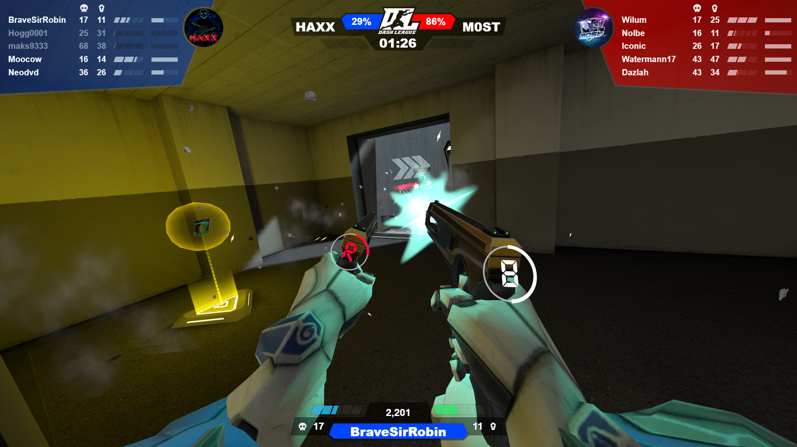

# DashCam
Dashcam is an overlay for the game HyperDash. This is used together with "HyperBash" a mod for HyperDash.

It uses websockets to connect to hyperdash on port 46646.

## ShowCase

## Building
### using vite
- Install nodejs 16+ https://nodejs.org/
- open terminal and type 
- `"npm install"`
- `"npm run dev"`
